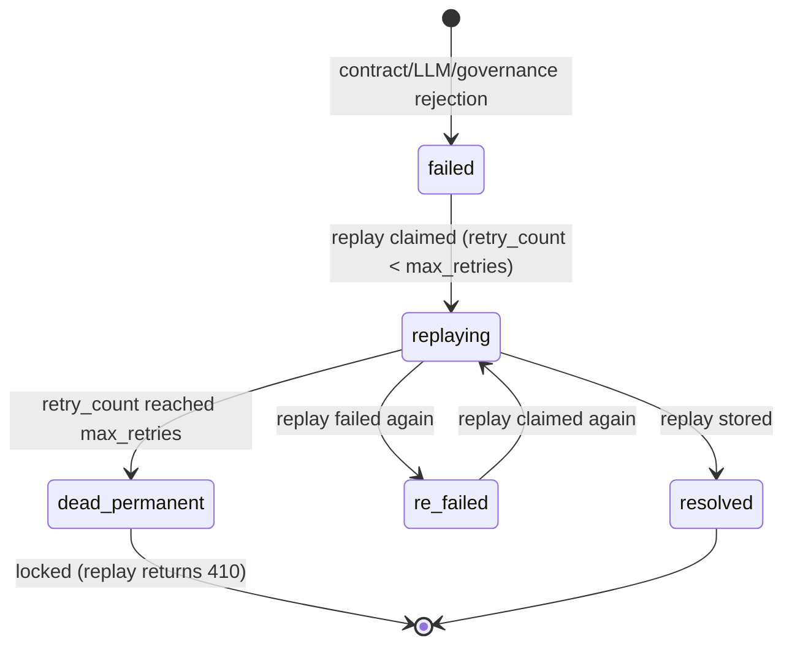

# 01 — Schema-Drift Self-Healing Ingestion

A production-grade webhook ingestion pipeline that guarantees **zero data loss and zero silent dirty writes** when upstreams duplicate deliveries, downstreams fail transiently, or quietly rename fields — without paying an LLM tax on every request.

[中文说明](#中文说明) · Back to [main README](../README.md)

---

## The problem this solves

Three failure modes break naive n8n ingestion pipelines:

| Failure mode | What naive pipelines do | What this pipeline does |
| :-- | :-- | :-- |
| Upstream re-delivers the same event (at-least-once semantics) | Writes duplicate rows | Atomic idempotency claim in Postgres; duplicates answered `200 duplicate_skipped` |
| Upstream renames a field (`customer_email` → `client_mail`) | Writes `NULL`s silently — the green-light dirty write | Contract gate catches it; LLM proposes a 1:1 rename; validated mapping is cached and every later payload heals with 0 tokens |
| Payload is genuinely broken / requires unit conversion | Either crashes or writes garbage | Dead-letter queue with a poison-pill-proof state machine; human replays after fixing |

---

## Data model (`../db/init.sql`)

| Table | Purpose |
| :-- | :-- |
| `idempotency_keys` | `(key, status)` — atomic claim via `INSERT ... ON CONFLICT DO NOTHING RETURNING`; status: `PROCESSING / resolved / failed` |
| `field_mapping_cache` | Learned renames, **scoped by `source_id`** (`UNIQUE (source_id, drifted_key)`), with `confidence`, `learned_at`, `sample_value_hash`, `hit_count`, `status (active/revoked)` |
| `dlq` | Dead letters with `UNIQUE (idempotency_key)` — replays update the same row instead of cloning orphans; `status`: `failed / replaying / resolved / re_failed / dead_permanent`, `retry_count` vs `max_retries` |
| `business_leads` | The actual business records, deduplicated by `(source_id, event_id)` |

## Pipeline walkthrough (34 nodes)

**Ingress & identity**
1. `Webhook Ingest` — POST `/webhook/ingest`, responds via explicit Respond nodes.
2. `Extract & Fingerprint` — derives `sourceId` (from `x-source-id` header, payload `source` fallback, else `default_source`); builds the idempotency key as `sourceId:event_id` (falls back to a **recursively canonicalized SHA-256** fingerprint when no `event_id` — note `JSON.stringify`'s array replacer silently drops nested keys, which is why a hand-rolled `canonicalize()` is used).

**Idempotency**
3. `Idempotency Claim` — `INSERT INTO idempotency_keys ... ON CONFLICT (key) DO NOTHING RETURNING key`. Empty result ⇒ duplicate.
4. `Is New Event?` → duplicates are *not* blindly skipped: `Check Key Status` distinguishes `resolved` (→ `200 duplicate_skipped`) from `PROCESSING`/`failed` (→ `409 duplicate_unresolved`, pointing at the replay endpoint).

**Deterministic contract gate (0 tokens)**
5. `Load Active Mappings` → `Normalize` — applies the source-scoped, `active` renames; collects `appliedRules`.
6. `Bump Hit Count` — increments cache observability counters for every rule actually applied.
7. `Contract Validation` — checks `customer_email` (email string), `amount` (finite number), `company` (non-empty string); builds the PII-safe **type skeleton** (`{"client_mail": "string (email)", ...}`) used by the LLM.

**LLM self-healing bypass (only on contract failure)**
8. `Build Healer Prompt` → `LLM Schema Healer` (DeepSeek `deepseek-flash`, `response_format: json_object`, temperature 0, 30s timeout) → `Parse Healer Verdict` (structural validation of the LLM's JSON).
9. `Recoverable & Confident?` — requires `is_recoverable && confidence ≥ 0.95 && non-empty mapping`.
10. `Mapping To Rows` → `Heal & Persist Prep` — applies the proposed mapping in memory.
11. `Validate Healed Record` → `Healed Contract Pass?` — **the healed record must re-pass the same deterministic contract**. A hallucinated or partial mapping cannot reach the database.
12. `Save Learned Mapping` — upserts the mapping **but never overwrites a `revoked` rule** (`DO UPDATE ... WHERE status <> 'revoked'`).
13. `Check Mapping Governance` → `Mapping Accepted?` — reconciliation: attempted rules must equal accepted rules; a rule that was revoked by an operator sends this event to the DLQ instead of silently re-activating.
14. `Assemble Business Record` → `Persist Business Record` (upsert, `RETURNING id` = row-count assertion) → `Mark Resolved` → `200 stored` with `self_healed` flag.
15. `Send Drift Alert` — posts the mapping + revoke hint to the configured webhook (fail-open).

**Dead-letter path**
16. `Prep DLQ Entry` → `Write DLQ` (`ON CONFLICT (idempotency_key) DO UPDATE` — replays never clone orphan rows) → `Mark Failed` → `202 queued_to_dlq` + `Send DLQ Alert` (fail-open).

## DLQ state machine



`Claim` is a single atomic statement: `UPDATE ... SET status='replaying', retry_count = retry_count+1 WHERE dlq_id=$1 AND (status IN ('failed','re_failed') AND retry_count < max_retries OR status='replaying' AND updated_at < now() - interval '10 minutes')`. The stale-`replaying` branch means a crashed replay attempt cannot deadlock a row forever.

## Design decisions worth defending in an interview

- **Why a persistent table instead of `$getWorkflowStaticData()`?** `staticData` is not persisted for manual canvas executions (`Test workflow`), so any interviewer testing by hand would see dedup silently fail. Postgres makes the guarantee real and demonstrable.
- **Why validate *after* LLM healing?** The whole point of the project is eliminating silent dirty writes; letting an LLM-mapped record skip the deterministic contract would reintroduce exactly that failure — via the AI.
- **Why reconciliation (`attempted == accepted`)?** An upsert that cannot update a revoked rule returns fewer rows than attempted; treating that as success would let the operator's revocation be bypassed on the very next event.
- **Why is the LLM only given key names + types?** PII never leaves the instance, prompts stay tiny, and the model cannot be biased by actual values (e.g. mapping `total_cents=12999` to `amount` looks "obviously right" only when you can see the value — exactly the mistake we forbid).
- **Why does a failed duplicate get `409` instead of `200`?** A silent 200 would hide data loss from the upstream; 409 + pointer to the replay endpoint makes the retry contract explicit.

## Test guide

Start the stack and configure n8n per the [main README](../README.md#quick-start), then:

```bash
# 1. happy path
curl "http://localhost:8888/fire?mode=normal"           # → 200 {"status":"stored","self_healed":false,...}

# 2. idempotency
curl "http://localhost:8888/fire?mode=duplicate&times=2" # → stored + duplicate_skipped

# 3. self-healing (first call wakes the LLM, second uses the cache)
curl "http://localhost:8888/fire?mode=drift"             # → 200 self_healed:true
curl "http://localhost:8888/fire?mode=drift"             # → 200 self_healed:false (0 tokens)

# 4. unit-conversion trap → dead letter
curl "http://localhost:8888/fire?mode=unit_drift"        # → 202 queued_to_dlq

# 5. garbage → dead letter
curl "http://localhost:8888/fire?mode=dirty"             # → 202 queued_to_dlq

# 6. replay until poison-pill lock
curl -X POST http://localhost:5678/webhook/dlq-replay -H "Content-Type: application/json" -d '{"dlq_id":"<uuid>"}'
# → 422 replay_failed (re_failed) ... after max_retries: 410 not_replayable (dead_permanent)

# 7. revoke governance
curl -X POST http://localhost:5678/webhook/mapping-revoke -H "Content-Type: application/json" -d '{"rule_id":"default_source:client_mail"}'
curl "http://localhost:8888/fire?mode=drift"             # → 202, "rejected by governance (previously revoked)"

# 8. multi-tenant isolation
curl "http://localhost:8888/fire?mode=drift&source=tenantB"  # → own namespace, own mappings
```

Verify state:

```bash
docker exec n8n-resilient-db psql -U n8n -d n8n_resilient \
  -c "SELECT rule_id, drifted_key, target_key, confidence, hit_count, status FROM field_mapping_cache;" \
  -c "SELECT status, retry_count, max_retries FROM dlq;" \
  -c "SELECT source_id, event_id, email, amount, company FROM business_leads;"
```

<!-- Screenshots: n8n canvas, drift alert message, DLQ table before/after replay -->

## Limitations

See ["Honest limitations"](../README.md#honest-limitations) in the main README — notably the `PROCESSING` stuck window, unauthenticated management endpoints, and the spoofable `source` fallback.

---

## 中文说明

生产级 Webhook 数据摄入管道：上游重复投递、下游瞬态故障、或**悄悄改字段名**时，保证零丢失、零静默脏写——且正常流量不产生任何 LLM 开销。

**三种故障模式的应对**：重复投递 → Postgres 原子幂等认领；字段漂移 → 契约网关拦截 + LLM 提出 1:1 重命名（仅键名与类型签名，PII 脱敏）→ 校验通过后入缓存，后续同构数据零 Token 治愈；真脏数据/单位换算 → 带毒丸保护的死信状态机交人工处理。

**值得在面试中捍卫的设计决策**（详见上方英文小节）：持久化表而非 `staticData`（手动测试不持久化）、治愈后强制重过确定性契约、治理对账防撤销被绕过、LLM 只看键名（脱敏 + 防值偏置）、失败重发返回 409 而非吞掉。

**测试**：按主 README 配好环境后，用 `mock-chaos-server` 的 `mode=normal|duplicate|drift|unit_drift|dirty` 与 `&source=` 参数逐项注入，配合 `/webhook/dlq-replay` 与 `/webhook/mapping-revoke` 端点验证死信状态机与治理闭环；SQL 核对命令见上方。
