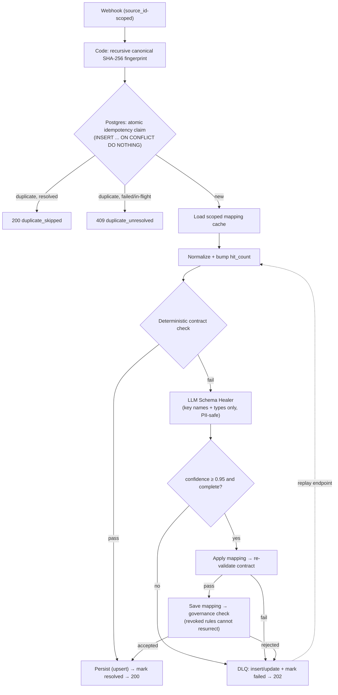

# n8n Resilient Agentic Patterns

[中文文档](./README.zh-CN.md)

Production-grade, self-healing workflow patterns for n8n — built to demonstrate real engineering depth, not tutorial-level template assembly.

Two independent projects in one repository:

| # | Project | Status |
| :-- | :-- | :-- |
| 01 | [Schema-Drift Self-Healing Ingestion](./01-schema-drift-self-healing-ingestion/) — webhook ingestion with Postgres-backed idempotency, a scoped learned-mapping cache, an LLM self-healing bypass, and a dead-letter-queue state machine | ✅ implemented & live-tested (9/9 test scenarios) |
| 02 | Self-Introspecting Error Hotfix PR Generator — an error workflow that pulls the failed workflow's static JSON and the crashed execution's runtime data via n8n's own public API, synthesizes a node-level JSON patch with an LLM, and opens a GitHub PR (with `versionId` optimistic locking before any hot-update) | 🚧 in progress |

---

## Why these two projects exist

Most n8n portfolio content stops at "form → spreadsheet → email". These projects target two concrete engineering gaps that existing open-source solutions openly admit they cannot cover:

1. **The green-light dirty write.** When an upstream API silently renames a field (`customer_email` → `client_mail`), deterministic nodes don't fail: rows are written with `NULL`s, item counts look normal, dashboards stay green. The [`tachyurgy/n8n-automation-portfolio`](https://github.com/tachyurgy/n8n-automation-portfolio) hardening kit states in its own README: *"It cannot see inside a green execution's data."*
2. **Shallow error handling.** n8n's `Error Trigger` only surfaces the error message and the last node's name. No community workflow today (as of 2026-09) combines the failed node's static configuration with the crashed execution's actual upstream data to synthesize a directly-mergeable fix.

## Project 01 in one paragraph

A webhook ingestion pipeline where 100% of well-formed traffic passes a deterministic contract gate (0 LLM tokens, millisecond latency). The first payload that violates the contract wakes a lightweight LLM healer that sees only key names and type signatures (never PII values) and decides whether the unknown keys are safe 1:1 renames. Accepted mappings are persisted to a per-source scoped cache with full audit metadata; every later payload of the same shape is healed deterministically with zero tokens. Anything the healer cannot safely map — including unit-conversion traps like `total_cents` vs `amount` — lands in a dead-letter queue with a strict state machine (`failed → replaying → resolved / re_failed / dead_permanent`) that makes poison-pill loops impossible.

### Architecture



### Live test evidence (2026-09-29, n8n 2.40.7, deepseek-flash)

| Scenario | Injected chaos | Result |
| :-- | :-- | :-- |
| Happy path | normal payload | `200 {"status":"stored"}`; row in `business_leads`; idempotency key `resolved` |
| Duplicate delivery | same `event_id` ×2 | second attempt: `200 {"status":"duplicate_skipped"}`, no duplicate row |
| First schema drift | `customer_email`→`client_mail`, `company`→`org_name` | `200 {"status":"stored","self_healed":true}`; two mappings cached at confidence 0.95 |
| Steady-state healing | same drift again | `200 {"status":"stored","self_healed":false}` — cache hit, **zero LLM calls**, `hit_count` incremented |
| Unit-conversion trap | `amount`→`total_cents` (integer cents) | `202 queued_to_dlq` — LLM correctly **refuses** to map across units |
| Replay (recoverable failure) | replay once | `422 replay_failed`, DLQ → `re_failed`, `retry_count=1`, **no orphan rows** |
| Poison pill | replay ×3 | `retry_count=3` → `dead_permanent`; further replays rejected with `410` |
| Replay after fix (full loop) | re-activate the mapping, replay the governed DLQ item | `200 {"status":"replay_resolved"}`; DLQ → `resolved`; the payload is healed and stored |
| Mapping governance | revoke a learned rule, replay drift | LLM tries to re-learn → **rejected by governance**, routed to DLQ; revoked rule stays `revoked` |
| Multi-tenant isolation | drift from `source=tenantB` | separate cache namespace; `default_source`'s revoked rule untouched |

Reproduce these yourself in 5 minutes — see the [Quick start](#quick-start).

---

## Quick start

### Prerequisites

- Docker + Docker Compose
- A DeepSeek API key (any OpenAI-compatible provider works — the healer is a plain HTTP Request node; change `url` and `model`)

### 1. Start the stack

```bash
docker compose up -d
# → n8n on http://localhost:5678
# → Postgres (business tables auto-created from db/init.sql)
# → mock-chaos-server on http://localhost:8888
```

### 2. Configure n8n (one-time, ~3 minutes)

1. Open `http://localhost:5678`, create a local owner account.
2. **Credentials → Create Credential → Postgres**
   Host `postgres` · Database `n8n_resilient` · User `n8n` · Password `n8n` · Port `5432` · SSL `disable`
3. **Credentials → Create Credential → Header Auth**
   Name `Authorization` · Value `Bearer <your-deepseek-key>`
4. **Import the three workflows** from `01-schema-drift-self-healing-ingestion/`
   (`workflow-ingestion-main.json`, `workflow-dlq-replay.json`, `workflow-mapping-revoke.json`).
   For each Postgres node, re-select the credential you created; for `LLM Schema Healer`, select the Header Auth credential.
5. **Publish** all three (n8n 2.x requires publishing for production webhook URLs).

### 3. Fire the chaos suite

```bash
# happy path → 200 stored
curl "http://localhost:8888/fire?mode=normal"

# duplicate delivery → 200 duplicate_skipped on 2nd send
curl "http://localhost:8888/fire?mode=duplicate&times=2"

# schema drift → first send self-heals (200 self_healed:true), second send hits the cache (self_healed:false)
curl "http://localhost:8888/fire?mode=drift"
curl "http://localhost:8888/fire?mode=drift"

# unit-conversion trap → LLM refuses, 202 queued_to_dlq
curl "http://localhost:8888/fire?mode=unit_drift"

# unrecoverable garbage → 202 queued_to_dlq
curl "http://localhost:8888/fire?mode=dirty"

# multi-tenant isolation
curl "http://localhost:8888/fire?mode=drift&source=tenantB"
```

### 4. Verify in Postgres

```bash
docker exec n8n-resilient-db psql -U n8n -d n8n_resilient \
  -c "SELECT * FROM business_leads;" \
  -c "SELECT rule_id, drifted_key, target_key, confidence, hit_count, status FROM field_mapping_cache;" \
  -c "SELECT dlq_id, status, retry_count, max_retries FROM dlq;"
```

### 5. Dead-letter replay & mapping revoke

```bash
# replay a DLQ item (get dlq_id from the 202 response or the dlq table)
curl -X POST http://localhost:5678/webhook/dlq-replay \
  -H "Content-Type: application/json" -d '{"dlq_id":"<uuid>"}'
# → 200 replay_resolved | 422 replay_failed (re_failed) | 410 not_replayable (dead_permanent)

# revoke a learned mapping (it will NOT be auto-relearned afterwards)
curl -X POST http://localhost:5678/webhook/mapping-revoke \
  -H "Content-Type: application/json" -d '{"rule_id":"default_source:client_mail"}'
```

---

## Honest limitations

Deliberately documented so reviewers don't have to discover them:

- **`PROCESSING` stuck window.** If the n8n instance dies between the idempotency claim and the final status update, the key stays `PROCESSING`; duplicate deliveries then receive `409 duplicate_unresolved` until manual cleanup. Recovery automation is a documented non-goal for v1.
- **Management endpoints are unauthenticated.** `/webhook/dlq-replay` and `/webhook/mapping-revoke` perform no auth in this demo. Behind a reverse proxy, add auth at the proxy layer, or enable the webhook node's built-in Header Auth.
- **`sourceId` fallback is spoofable.** The `x-source-id` header is authoritative; the payload `source` field is a convenience fallback and can be forged by an upstream. In production, derive the scope from the webhook path or a secret.
- **Alerting is fail-open.** `Send Drift Alert` / `Send DLQ Alert` post to `$env.DRIFT_ALERT_WEBHOOK_URL` / `$env.DLQ_ALERT_WEBHOOK_URL` (set them in `docker-compose.yml`; empty = disabled). On failure they continue silently — they must never block ingestion.
- **Healing scope is key-rename only.** The healer never performs unit conversions, computations, or value inventions; anything requiring transformation is dead-lettered for a human.
- **Concurrency level.** SQLite/n8n Data-Table deployments suit < 20 RPS; the shipped setup uses Postgres with atomic `INSERT ... ON CONFLICT` claims.

---

## Repository layout

```text
├── docker-compose.yml                        # n8n 2.40.7 + Postgres 16 + mock-chaos-server
├── db/init.sql                               # business tables, auto-created on first start
├── mock-chaos-server/                        # ~90-line Node.js chaos injector
│   ├── server.js                             #   modes: normal | duplicate | drift | unit_drift | dirty
│   └── Dockerfile
├── 01-schema-drift-self-healing-ingestion/
│   ├── workflow-ingestion-main.json          # 34-node main pipeline
│   ├── workflow-dlq-replay.json              # DLQ replay with state machine
│   ├── workflow-mapping-revoke.json          # mapping revoke endpoint
│   └── README.md                             # deep-dive: design decisions & test guide
└── 02-self-introspecting-error-hotfix-pr/    # (in progress)
```

## License

MIT
