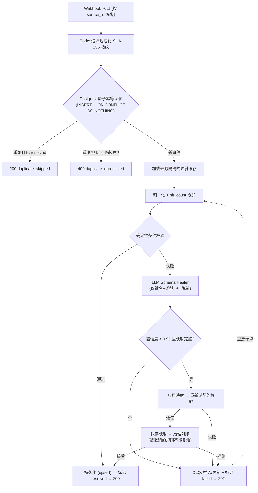

# n8n Resilient Agentic Patterns

[English](./README.md)

面向 n8n 的生产级自愈工作流模式集——以真实工程深度为目标，拒绝教程级模板拼接。

本仓库包含两个相互独立的项目：

| # | 项目 | 状态 |
| :-- | :-- | :-- |
| 01 | [Schema 漂移自愈数据摄入](./01-schema-drift-self-healing-ingestion/) —— 带 Postgres 幂等、按来源隔离的学习式映射缓存、LLM 自愈旁路与死信队列状态机的 Webhook 摄入管道 | ✅ 已实现并实测（9/9 场景通过） |
| 02 | 自省式故障热修 PR 生成器 —— 错误工作流通过 n8n 公开 API 同时拉取故障工作流的静态 JSON 与崩溃执行的运行态数据，由 LLM 合成节点级 JSON 补丁并发起 GitHub PR（热更新前做 `versionId` 乐观锁校验） | 🚧 进行中 |

---

## 为什么做这两个项目

大多数 n8n 简历项目止步于「表单 → 表格 → 发邮件」。这两个项目瞄准的是现有开源方案**自己承认覆盖不了**的两个工程缺口：

1. **绿灯静默脏写。** 当上游悄悄把字段改名（`customer_email` → `client_mail`），确定性节点不会报错：数据带着 `NULL` 入库、条数正常、监控全绿。[`tachyurgy/n8n-automation-portfolio`](https://github.com/tachyurgy/n8n-automation-portfolio) 的加固套件在其 README 中直言：*"It cannot see inside a green execution's data."*（它看不见绿灯执行内部的数据。）
2. **浅层错误处理。** n8n 的 `Error Trigger` 只吐出报错消息和最后执行的节点名。截至 2026 年 9 月，尚无社区工作流将「故障节点的静态配置」与「崩溃瞬间的上游实际数据」结合，合成可直接合并的修复补丁。

## 项目一：一段话说明

一条 Webhook 摄入管道：100% 的正常流量走确定性契约网关（**0 Token、毫秒级**）。第一条违反契约的数据唤醒轻量 LLM 治愈器——它只看到键名和类型签名（**绝不接触 PII 原值**），判断陌生键是否为安全的 1:1 重命名。被接受的映射连同完整审计元数据持久化到**按来源隔离**的缓存表；之后同结构的数据全部走确定性治愈，**零 Token**。治愈器无法安全映射的一切——包括 `total_cents` vs `amount` 这类单位换算陷阱——进入死信队列，由严格状态机（`failed → replaying → resolved / re_failed / dead_permanent`）保护，毒丸消息的无限重放在结构上不可能。

### 架构



### 实测证据（2026-09-29，n8n 2.40.7，deepseek-flash）

| 场景 | 注入的混沌 | 结果 |
| :-- | :-- | :-- |
| 正常路径 | 正常载荷 | `200 {"status":"stored"}`；业务表新增行；幂等键 `resolved` |
| 重复投递 | 同一 `event_id` ×2 | 第二次：`200 {"status":"duplicate_skipped"}`，无重复行 |
| 首次 Schema 漂移 | `customer_email`→`client_mail`、`company`→`org_name` | `200 {"status":"stored","self_healed":true}`；两条映射以置信度 0.95 入缓存 |
| 稳态治愈 | 同样漂移再来一条 | `200 {"status":"stored","self_healed":false}` —— 命中缓存，**零 LLM 调用**，`hit_count` 累加 |
| 单位换算陷阱 | `amount`→`total_cents`（整数分） | `202 queued_to_dlq` —— LLM 正确**拒绝**跨单位映射 |
| 重放（可恢复失败） | 重放一次 | `422 replay_failed`，死信 → `re_failed`，`retry_count=1`，**无孤儿行** |
| 毒丸消息 | 连续重放 ×3 | `retry_count=3` → `dead_permanent`；后续重放返回 `410` |
| 修复后重放（全闭环） | 恢复被撤销的映射后重放治理死信 | `200 {"status":"replay_resolved"}`；死信 → `resolved`；该载荷治愈入库 |
| 映射治理 | 撤销一条已学习规则后再投漂移数据 | LLM 试图重学 → **被治理拒绝**，路由至 DLQ；被撤销规则保持 `revoked` |
| 多租户隔离 | `source=tenantB` 的漂移数据 | 独立缓存命名空间；`default_source` 被撤销的规则不受影响 |

按 [快速开始](#快速开始) 的步骤，5 分钟可复现以上全部结果。

---

## 快速开始

### 前置条件

- Docker + Docker Compose
- 一个 DeepSeek API Key（任何 OpenAI 兼容服务商均可——治愈器就是一个 HTTP Request 节点，改 `url` 和 `model` 即可）

### 1. 启动整套环境

```bash
docker compose up -d
# → n8n: http://localhost:5678
# → Postgres（业务表由 db/init.sql 自动创建）
# → mock-chaos-server: http://localhost:8888
```

### 2. 配置 n8n（一次性，约 3 分钟）

1. 打开 `http://localhost:5678`，注册本地管理员账号。
2. **Credentials → Create Credential → Postgres**
   Host `postgres` · Database `n8n_resilient` · User `n8n` · Password `n8n` · Port `5432` · SSL `disable`
3. **Credentials → Create Credential → Header Auth**
   Name `Authorization` · Value `Bearer <你的 DeepSeek Key>`
4. **导入三个工作流**（位于 `01-schema-drift-self-healing-ingestion/`）
   （`workflow-ingestion-main.json`、`workflow-dlq-replay.json`、`workflow-mapping-revoke.json`）。
   每个 Postgres 节点重新选一下刚建的凭证；`LLM Schema Healer` 选择 Header Auth 凭证。
5. 三个工作流全部 **Publish**（n8n 2.x 必须发布后生产 Webhook 路径才生效）。

### 3. 注入混沌测试

```bash
# 正常路径 → 200 stored
curl "http://localhost:8888/fire?mode=normal"

# 重复投递 → 第二次 200 duplicate_skipped
curl "http://localhost:8888/fire?mode=duplicate&times=2"

# Schema 漂移 → 第一次自愈 (200 self_healed:true)，第二次命中缓存 (self_healed:false)
curl "http://localhost:8888/fire?mode=drift"
curl "http://localhost:8888/fire?mode=drift"

# 单位换算陷阱 → LLM 拒绝，202 queued_to_dlq
curl "http://localhost:8888/fire?mode=unit_drift"

# 不可恢复的脏数据 → 202 queued_to_dlq
curl "http://localhost:8888/fire?mode=dirty"

# 多租户隔离
curl "http://localhost:8888/fire?mode=drift&source=tenantB"
```

### 4. 到 Postgres 里核对

```bash
docker exec n8n-resilient-db psql -U n8n -d n8n_resilient \
  -c "SELECT * FROM business_leads;" \
  -c "SELECT rule_id, drifted_key, target_key, confidence, hit_count, status FROM field_mapping_cache;" \
  -c "SELECT dlq_id, status, retry_count, max_retries FROM dlq;"
```

### 5. 死信重放与映射撤销

```bash
# 重放一条死信（dlq_id 来自 202 响应或 dlq 表）
curl -X POST http://localhost:5678/webhook/dlq-replay \
  -H "Content-Type: application/json" -d '{"dlq_id":"<uuid>"}'
# → 200 replay_resolved | 422 replay_failed (re_failed) | 410 not_replayable (dead_permanent)

# 撤销一条已学习的映射（此后不会被自动重学）
curl -X POST http://localhost:5678/webhook/mapping-revoke \
  -H "Content-Type: application/json" -d '{"rule_id":"default_source:client_mail"}'
```

---

## 能力边界（诚实声明）

刻意写明，免得审阅者自己踩坑：

- **`PROCESSING` 卡死窗口。** 若 n8n 实例在幂等认领与最终状态更新之间崩溃，该键停留在 `PROCESSING`，重复投递会收到 `409 duplicate_unresolved`，需人工清理。v1 明确不做自动恢复。
- **管理端点无鉴权。** `/webhook/dlq-replay` 与 `/webhook/mapping-revoke` 在本 demo 中未做鉴权。生产环境请在反向代理层加鉴权，或启用 Webhook 节点内置的 Header Auth。
- **`sourceId` 兜底可伪造。** `x-source-id` 请求头是权威来源；载荷里的 `source` 字段只是便利兜底，上游可伪造。生产中应从 Webhook 路径或密钥派生。
- **告警是失败放行（fail-open）设计。** `Send Drift Alert` / `Send DLQ Alert` 向 `$env.DRIFT_ALERT_WEBHOOK_URL` / `$env.DLQ_ALERT_WEBHOOK_URL` 发送（在 `docker-compose.yml` 中配置；留空 = 关闭）。失败时静默继续——告警绝不能阻塞摄入主链路。
- **治愈范围仅限键名重命名。** 治愈器绝不做单位换算、数值计算或数据捏造；凡需变换的一律进死信队列交人工处理。
- **并发级别。** SQLite / n8n Data Table 部署适合 < 20 RPS；本仓库默认使用 Postgres + 原子 `INSERT ... ON CONFLICT` 认领。

---

## 仓库结构

```text
├── docker-compose.yml                        # n8n 2.40.7 + Postgres 16 + mock-chaos-server
├── db/init.sql                               # 业务表，首次启动自动创建
├── mock-chaos-server/                        # 约 90 行的 Node.js 混沌注入器
│   ├── server.js                             #   模式: normal | duplicate | drift | unit_drift | dirty
│   └── Dockerfile
├── 01-schema-drift-self-healing-ingestion/
│   ├── workflow-ingestion-main.json          # 34 节点主管道
│   ├── workflow-dlq-replay.json              # 带状态机的 DLQ 重放
│   ├── workflow-mapping-revoke.json          # 映射撤销端点
│   └── README.md                             # 深度解析：设计决策与测试指南
└── 02-self-introspecting-error-hotfix-pr/    # （进行中）
```

## 许可证

MIT
